# Top 25 Viral Contest & Giveaway Platforms Ranked in 2025 (Latest Compilation)

Marketers looking to **rapidly grow their audience** and boost engagement often turn to viral **contest and giveaway software**. These tools help you run interactive campaigns – from social media giveaways to refer-a-friend programs – that **capture leads and drive brand loyalty**. The platforms below tackle common pain points like campaign design, entry tracking, and fraud prevention, all while **maximizing reach** and minimizing manual effort. Whether you’re aiming to build an email list through a sweepstakes or launch a full-fledged referral marketing campaign, this **2025 roundup** promises solutions that are faster, easier, and more cost-effective than building contests from scratch.

## [VYPER](https://vyper.io)
*Free viral contest builder for quick audience growth.*

**VYPER** makes it simple to create viral giveaways, referral programs, and loyalty campaigns in minutes. It’s known for an **intuitive drag-and-drop editor** and ready-made templates that let you launch without coding. Marketers love VYPER’s gamified leaderboards and social sharing incentives, which helped one brand collect over **41,000 email leads** in a single contest. The platform supports multiple campaign types (sweepstakes, reward points, etc.) and offers robust integrations (Mailchimp, Zapier, Shopify, and more) for seamless data sync. Notably, VYPER’s team has evolved their product into a new app called *Blitz Rocket* for a revamped experience – but the core promise remains: **engage your audience and drive viral referrals** with minimal hassle. *(Free plan available; paid plans for advanced features.)*

## [UpViral](https://upviral.com)
*All-in-one viral referral campaigns with gamification.*

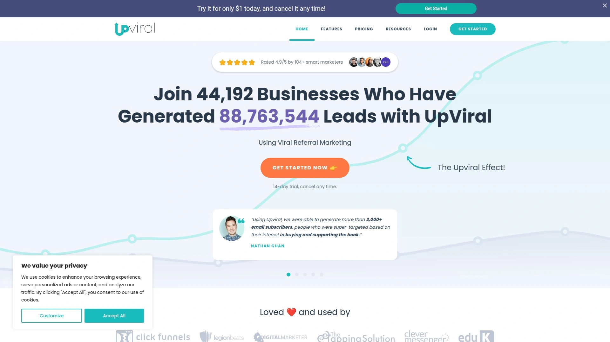

**UpViral** is a powerhouse for running viral contests and refer-a-friend programs. It provides a rich library of sweepstakes and contest templates that you can **gamify with points and leaderboards** to encourage sharing. UpViral’s standout features include an automatic reward delivery system (so referees get prizes when milestones are hit) and even **triple A/B testing** to optimize your campaign before it goes live. The platform has documented impressive results – for example, a single UpViral campaign generated over **90,000 leads in one month**. With multiple display options (landing page, embed form, pop-up, widget), marketers can tailor contests to any website. **Onboarding is beginner-friendly**, and their support is highly praised. *(14-day trial for $1; plans from $79/month with higher tiers for premium features.)*

## [Gleam](https://gleam.io)
*Popular giveaway platform with plug-and-play actions.*

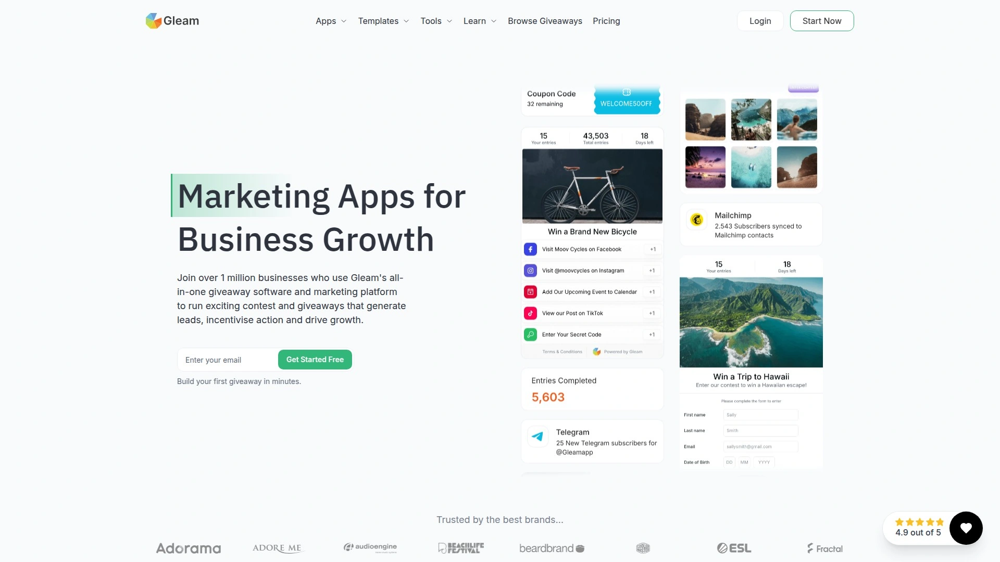

**Gleam** has long been a go-to tool for social media giveaways and competitions. It offers four modular apps – Competitions, Rewards, Gallery, and Captures – which you can mix and match for different campaign types. Gleam shines in its **wide integration support (100+ apps)** and a variety of entry actions (tweet, follow, subscribe, etc.) that you can enable. It features a robust winner selection system that filters invalid entries and **verifies winners automatically**, saving you time. With **25+ languages supported** and responsive widgets, Gleam is suitable for global campaigns. Marketers can choose from many pre-designed contest templates (photo contests, referral contests, surveys, etc.), making setup fast. *(Free plan available for basic competitions; paid plans unlock advanced features, starting at $10/month per feature or $97/month for the full suite.)*

## [ReferralCandy](https://www.referralcandy.com)
*Referral marketing tool for e-commerce growth.*

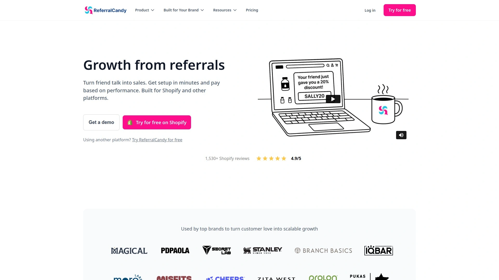

**ReferralCandy** focuses on refer-a-friend programs, particularly beloved by DTC and online retail brands. It’s an easy way to turn **happy customers into brand ambassadors** by rewarding referrals. ReferralCandy integrates seamlessly with e-commerce platforms (Shopify, WooCommerce, etc.) and automates the referral process – from sending invites after purchase to issuing rewards (like discounts or cash) when referrals convert. The software provides fraud detection to weed out suspicious referral activity and **analytics to track sales from referrals**. It’s trusted by many online stores (from popular fashion labels to gadget brands) for its **user-friendly experience** and results (the company cites big-name clients like Colgate and Steve Madden). If you’re new to referral or word-of-mouth marketing, ReferralCandy offers a **low-friction way to start** and even provides best-practice templates to run campaigns that encourage repeat sales. *(30-day free trial; then plans from $59/month + commission on referral sales.)*

## [Viral Loops](https://viral-loops.com)
*Template-based viral campaigns inspired by the best.*

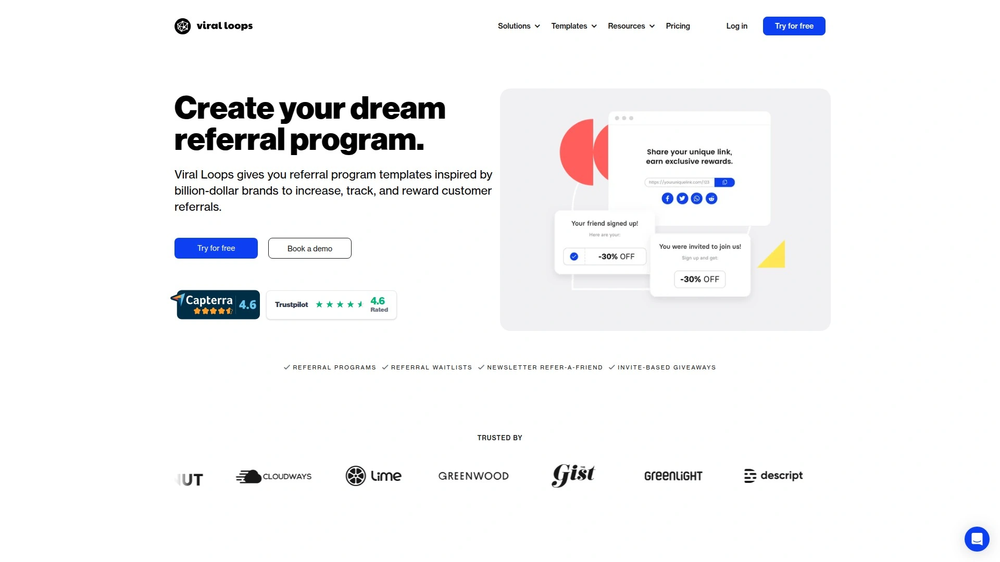

**Viral Loops** is an all-in-one platform for referral marketing, pre-launch waitlists, and viral giveaways. It comes with **campaign templates modeled after famous growth hacks** (think Dropbox’s referral program or the classic milestone rewards from Harry’s Razors). You can launch referral programs, leaderboard competitions, or sweepstakes by customizing these templates – no coding needed. Viral Loops offers embeddable widgets and landing pages that match your branding, plus a real-time dashboard to monitor sign-ups and shares. It integrates with email tools, Slack, CRMs, and more, making it easy to fit into your stack. The flexibility is great: run a pre-launch waitlist for a startup, a “Refer-a-Friend” campaign for an e-commerce store, or a viral giveaway for your newsletter. **Global support** (20+ languages) and anti-fraud checks are built in. *(Free trial available; paid plans from $49/month for startups, scaling up with higher volumes.)*

## [GrowSurf](https://growsurf.com)
*Plug-and-play referral software for startups.*

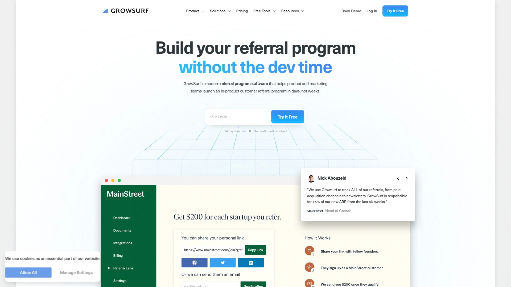

**GrowSurf** helps businesses create **automated referral programs** that reward customers for spreading the word. Aimed at SaaS companies and startups, it’s known for minimizing technical overhead – you can launch a refer-a-friend campaign **without any coding**, and it provides embeddable referral widgets for your website or app. GrowSurf automatically generates unique referral links for each user, making sharing effortless. It also boasts strong analytics: track referral counts, conversion rates, and top referrers from a clean dashboard to gauge your word-of-mouth growth. Key integrations (Slack, HubSpot, Intercom, PayPal, etc.) are supported out-of-the-box for automating reward payouts or syncing data. If your goal is organic customer acquisition on autopilot, GrowSurf’s **hands-off approach** (with features like automatic fraud detection and email notifications) is a compelling choice. *(Offers a demo; pricing is higher-end, with plans for thousands of participants starting around ~$775/month for 10k users and up.)*

## [ViralSweep](https://www.viralsweep.com)
*Sweepstakes and contest platform for lead generation.*

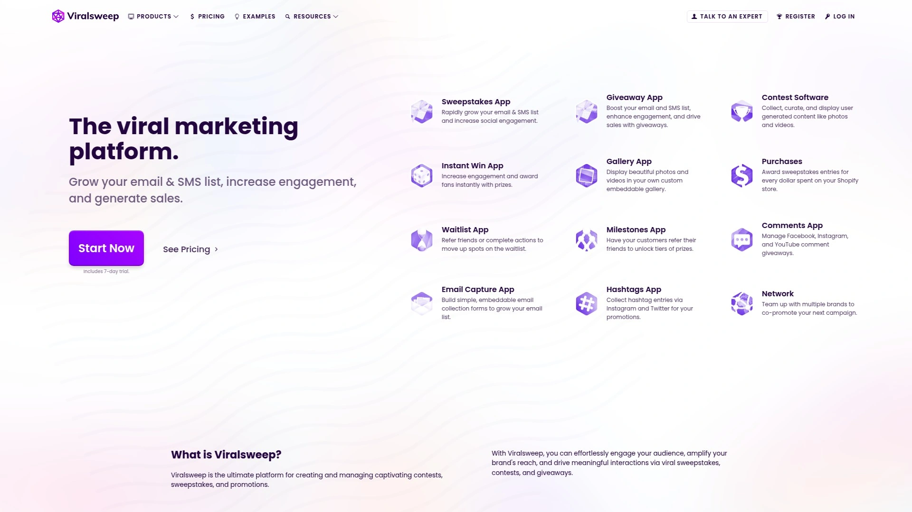

**ViralSweep** specializes in running sweepstakes, giveaways, and contests that you can embed on your own website. Established in 2012, it’s a mature platform used by brands like Qatar Airways and Apartment Therapy. ViralSweep covers everything needed for a successful giveaway: **entry form widgets** you can style and add to any site, an automatic **rules generator** (to create official contest rules pages), random winner selection tools, and even features for photo/video contests and voting competitions. It supports instant-win games and can filter out duplicate or fraudulent entries so you get quality leads. One big plus is its e-commerce integrations – connect it to Shopify, WooCommerce, or other platforms to incentivize purchases or verify actions. **Social media actions** (following, sharing, etc.) are also built-in, enabling multi-channel promotions. If you need to quickly spin up a professional sweepstakes that feeds into your email or SMS list, ViralSweep is one of the most complete solutions. *(7-day free trial; paid plans from $49/month and up for higher entry counts and features.)*

## [AppVirality](https://www.appvirality.com)
*Referral marketing SDK for mobile apps and SaaS.*

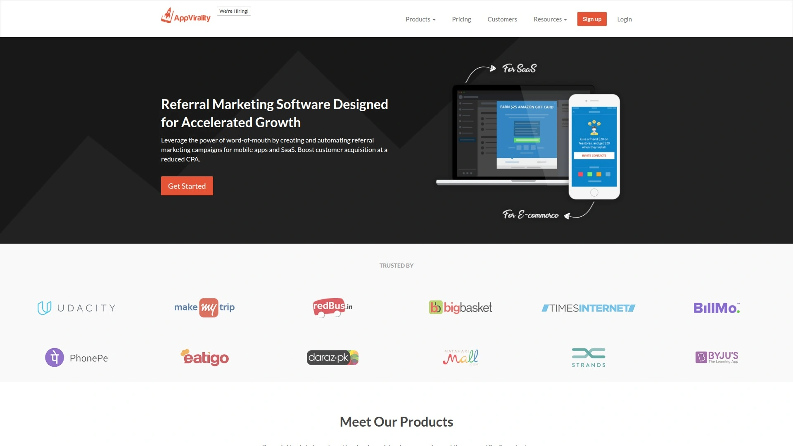

**AppVirality** is designed for companies that want to add **in-app referral programs** or user incentives into their mobile apps (or web products) with minimal coding. It provides a **drop-in SDK for iOS and Android** as well as a JavaScript snippet for web, allowing you to embed referral widgets and track installs or sign-ups driven by referrals. Marketers can configure the rules of a campaign without developer help – e.g., set reward types (coupon, points, cash), referral channels, and who gets rewarded (advocate, friend, or both). AppVirality also supports **tiered rewards and custom referral rules**, so you can run creative campaigns (like multi-level referrals or unique invite flows) tailored to your app’s needs. A big emphasis is on **white-label customization**: you can style the referral screens to match your app’s UI completely. Real-time analytics and fraud controls are included as well. This tool is ideal if you’re a mobile-first business looking to implement a full-featured refer-a-friend system **inside your own app** rather than via external landing pages. *(Offers separate plans for SaaS vs. mobile; pricing starts around $199/month for basic, with custom enterprise options.)*

## [ReferralHero](https://referralhero.com)
*One-stop platform for referral programs with anti-fraud.*

**ReferralHero** enables businesses to design and manage referral campaigns (think viral waitlists, product pre-launch referrals, and ambassador programs) without coding. It’s quite flexible: you can create **waitlist contests, milestone reward programs, or straightforward refer-and-reward campaigns** all from one dashboard. A highlight is its **robust anti-fraud system** – ReferralHero uses algorithms and ReCaptcha verification to ensure only valid, authentic referrals count, so your contests aren’t gamed by bots or fake emails. The platform integrates with over 500 apps (from HubSpot and Mailchimp to Slack and Webflow), which is useful for syncing contacts or triggering emails. You also get customization options for landing pages and emails, allowing you to host referral sign-up pages that look on-brand. For marketers, ReferralHero’s appeal is in its balance of simplicity and power: it’s easy enough for a small startup to launch a viral giveaway, but also **scalable with analytics and customization** for larger campaigns. *(14-day free trial; paid plans from $69/month and up based on features and participant limits.)*

## [Woorise](https://woorise.com)
*Easy all-in-one tool for contests, forms, and quizzes.*

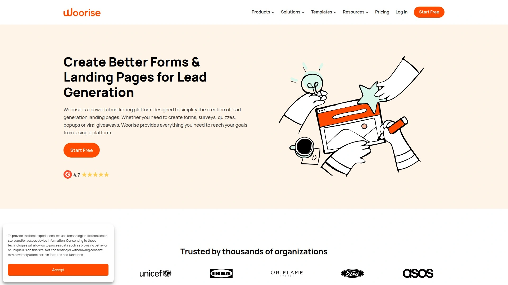

**Woorise** is a versatile lead generation platform that lets you create not just giveaways and contests, but also landing pages, surveys, quizzes, and more. For those who want an **all-in-one marketing contest solution**, Woorise is a strong contender. Its contest templates support popular social actions (liking pages, watching videos, etc.) and it includes features like **embedded forms, polls, and payment collection**, which means you can run a wider variety of campaigns (e.g. a contest + signup form combo). The interface is beginner-friendly, using a block-based editor to build your campaign pages. Woorise has a free tier that allows up to 500 entries on a contest, making it great for small campaigns or trials. While its free features are somewhat limited compared to competitors, it covers the core needs and even allows some **basic design customization** on the free plan. Upgrading unlocks integrations (email marketing sync, CRM) and removes entry caps. In short, Woorise is a **solid starter platform** for engaging your audience through contests and interactive content, especially if you value having everything (giveaways, surveys, landing pages) in one place. *(Free plan with entry limits; Pro plans from ~$29/month and up.)*

## [KingSumo](https://kingsumo.com)
*One-click viral giveaways with lifetime pricing option.*

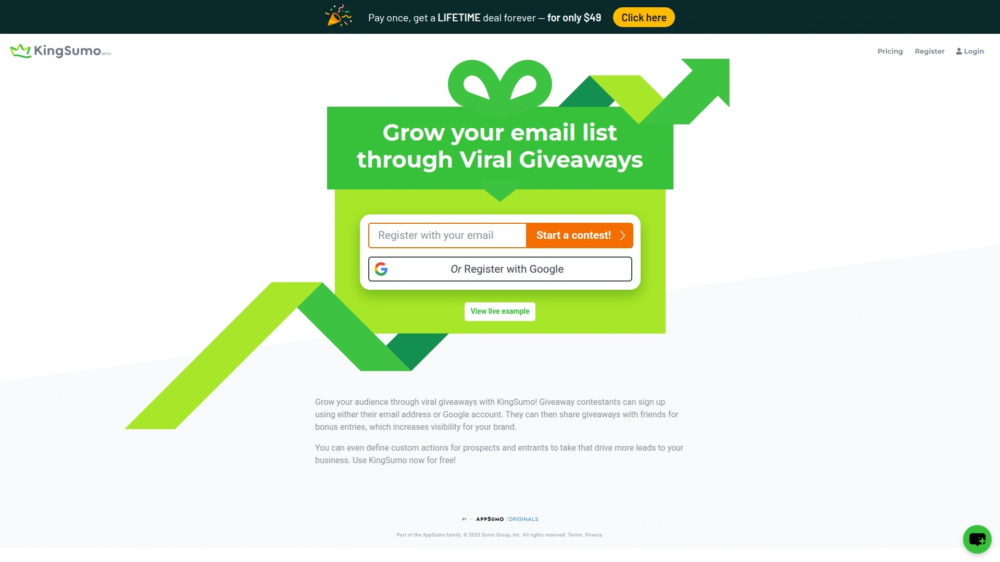

**KingSumo** is a lightweight yet powerful tool primarily for running viral giveaways that grow your email list. It’s popular among bloggers, content creators, and small businesses for its simplicity – you can set up a giveaway in minutes by just entering the prize details and basic settings. KingSumo giveaways encourage participants to perform extra actions (like referring friends or following on social media) to gain bonus entries, thereby increasing virality. It integrates with email providers (so new leads flow into your list) and has analytics for entries and conversion rates. One of KingSumo’s biggest attractions is its pricing model: aside from a basic free version, they offer a **lifetime premium plan for a one-time $49 purchase** that unlocks advanced features – an incredibly cost-effective deal compared to monthly subscriptions elsewhere. Despite the low cost, KingSumo includes handy features like Zapier integration and supports multiple languages for international contests. It may not have all the bells and whistles of enterprise platforms, but for **straightforward giveaways and maximum ROI**, KingSumo is a top choice. *(Free version available; Premium lifetime deal ~$49, sometimes offered via AppSumo.)*

## [Wishpond](https://www.wishpond.com)
*Marketing suite with robust social contest tools.*

**Wishpond** is a comprehensive marketing platform that includes a powerful social contest and promotions component. With Wishpond, you can launch a variety of contests – from sweepstakes and photo contests to Instagram hashtag contests and even leaderboard competitions. In fact, it offers **11 different contest and promotion types** (e.g. refer-a-friend, vote contests, coupons) to cover all your engagement needs. The contest builder is visual and code-free, providing lots of mobile-responsive templates that you can customize for your brand. Wishpond also stands out for its **marketing automation** tie-ins: because it has built-in landing page, popup, email, and CRM features, you can easily nurture the leads you capture from contests (e.g., send follow-up emails or drip campaigns to contest entrants). The analytics dashboard gives real-time metrics on entries, conversions, and social engagement, helping you gauge success across channels. Wishpond is especially suitable if you want an all-in-one solution – you get contest capabilities along with tools for general lead generation and email marketing. *(No fixed pricing published; typically requires contacting sales or starting a free trial, after which plans are custom-quoted or bundle-based.)*

## [RafflePress](https://rafflepress.com)
*WordPress plugin for viral giveaways and raffles.*

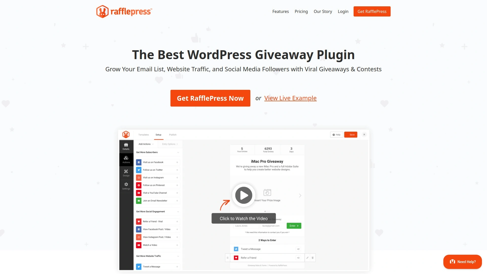

**RafflePress** is unique on this list as a dedicated WordPress plugin that lets site owners run viral giveaways directly on their WordPress site. If your website or blog is on WordPress, RafflePress integrates seamlessly via a drag-and-drop giveaway builder. It offers **pre-built giveaway templates** (for goals like growing your email list, Instagram followers, etc.) and supports 1-click entry actions, making it very easy for users to participate. You can embed the giveaway widget in posts or pages and require actions such as visiting a page, leaving a comment, or referring friends. RafflePress also includes **fraud protection** features (email verification, IP tracking) to ensure fair contests. For growing your audience, it hooks into popular email services and CRM tools to send the new leads straight to your mailing list. The plugin is known for being beginner-friendly – even non-technical bloggers can set up a contest in a few minutes. While RafflePress is paid for full functionality, it has a free version (with basic features) on the WordPress plugin repository. It’s an ideal choice if you prefer hosting contests on your own site and want a solution specifically **optimized for WordPress**. *(Free plugin available with limited features; Pro plans start around $79/year and up, often with discounts.)*

## [ShortStack](https://www.shortstack.com)
*Advanced contest platform for custom campaigns.*

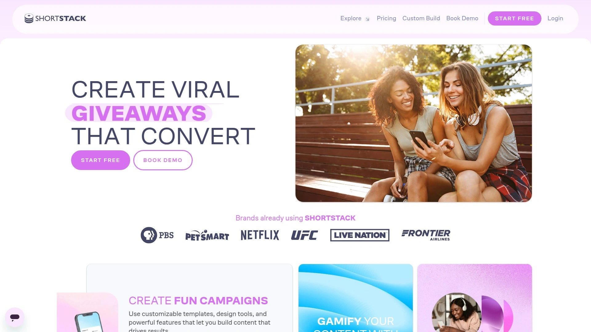

**ShortStack** has been around for over a decade, offering an **all-in-one contest and landing page platform** geared towards businesses and agencies that want more control over design and functionality. With ShortStack, you can create anything from simple sweepstakes to complex multi-stage contests and interactive quizzes. It provides a robust visual editor for designing your campaign pages, complete with **style panels for detailed customization** – you can tweak fonts, colors, layouts, or add custom CSS for a truly on-brand contest page. Notable features include a **prize management system** (to automate unique coupon code distribution and manage prize inventory), and a variety of publishing options (embed on your site, host on a custom domain, run as a Facebook page tab, etc.). ShortStack also has strong analytics in real time, showing views, entries, and traffic sources so you can optimize your campaign. For those concerned about timing and user experience, you can schedule campaigns to start/stop automatically and even set up exit-intent or timed pop-up contests. While it’s a premium product with higher pricing, ShortStack is favored by agencies and marketers who run a lot of promotions and need reliability, **white-label options, and deep customization**. *(Free trial available; paid plans from $99/month for small business, up to enterprise pricing for large brands.)*

## [Heyo](https://heyo.com)
*User-friendly tool for social media campaigns.*

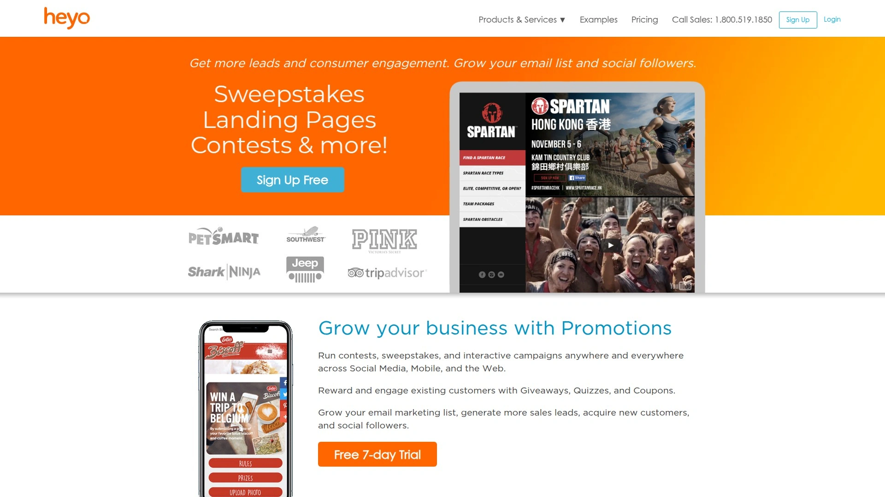

**Heyo** is a veteran in the social contest space, known for its easy-to-use campaign builder. It allows you to launch sweepstakes, photo and video contests, and other interactive campaigns on **Facebook, Twitter, Instagram, and the web** without coding. Heyo provides a variety of templates to choose from – you can pick a template for a Facebook timeline contest, an Instagram hashtag campaign, or a simple landing page giveaway, then customize text and images. Each template is mobile-responsive and elements can be edited with a drag-and-drop interface. One cool aspect: Heyo enables **multi-platform promotions** (for instance, you could run a contest on your Facebook page and embed the same entry form on your website). It also supports leaderboards and refer-a-friend mechanics to encourage sharing. For businesses that don’t have a big design team, Heyo’s templates and themes make contests look professional with minimal effort. The platform also offers **real-time analytics** and email lead exports, so you can measure entries and grab new subscriber info easily. In short, Heyo is all about helping you **grow your email list and social followers** through quick contests, making it a solid choice for small to mid-size brands. *(Free trial available; paid plans around $25–$199/month, with higher tiers for white-label and advanced features.)*

## [SweepWidget](https://sweepwidget.com)
*Feature-rich giveaway app with generous free plan.*

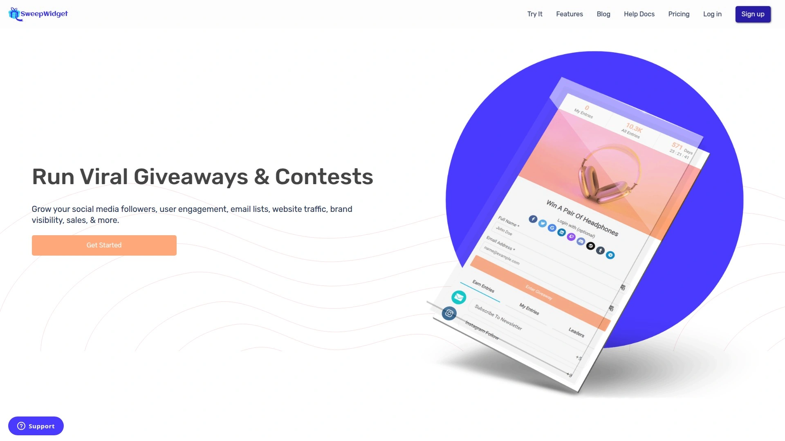

**SweepWidget** is a popular contest app that stands out for its **huge array of features and entry methods** – even on its free tier. With SweepWidget you can combine over *90 different entry actions* (across 30+ social media platforms) into one giveaway, letting participants engage in all sorts of ways. Examples include joining a Discord server, visiting a TikTok profile, answering a quiz question, or daily bonus entries – you have fine-grained control over what actions earn entries. The platform also supports advanced contest types like **leaderboard competitions** (where top referrers win) and instant coupon or prize rewards for certain actions. Customization is another strength: you can fully brand the widget’s appearance (colors, fonts, backgrounds) to match your site. SweepWidget’s dashboard makes it simple to pick winners (randomly or manually) and verify tasks; plus it offers anti-spam measures like captchas and entry blacklisting. Notably, **SweepWidget has a free plan** that allows unlimited participants and many features, making it incredibly appealing for those on a budget. For power users, paid plans unlock even more integrations (email APIs, webhooks) and remove branding. If you want a one-stop contest tool that’s *both* affordable and packed with functionality, SweepWidget is hard to beat. *(Free plan supports core features with unlimited entries; paid plans from $29/month for Pro with additional capabilities.)*

## [PerkZilla](https://perkzilla.com)
*Viral marketing tool with referrals and reward milestones.*

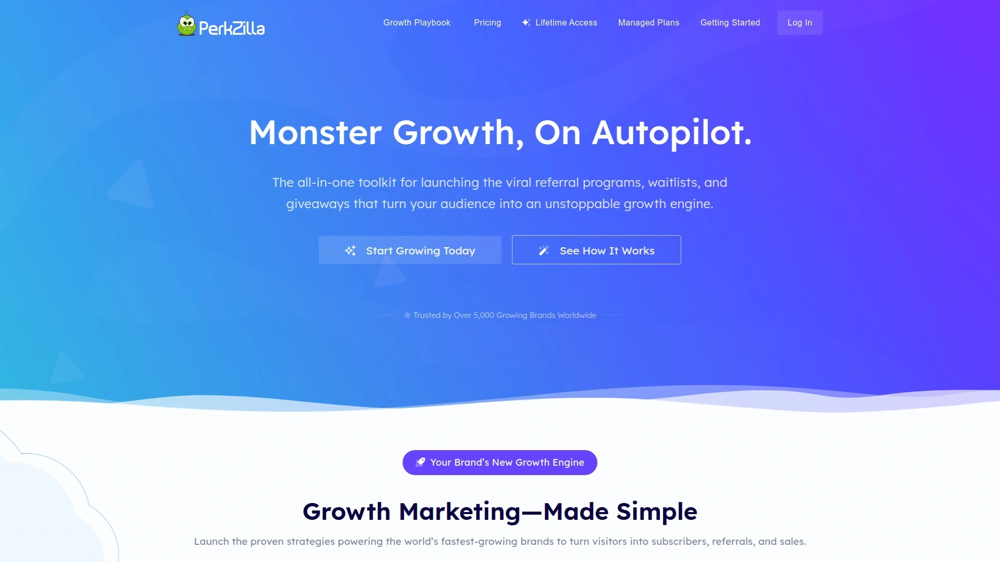

**PerkZilla** (tagline: “The Viral Marketing Monster”) helps turn your audience into a growth engine through **incentivized sharing and referrals**. It’s ideal for startups launching new products, content creators building an email list, or anyone running a pre-launch campaign. PerkZilla enables you to set up campaigns where users get **tiered rewards for referring others** – for example, refer 5 friends to unlock a perk, 10 friends for a bigger perk, etc. This gamified approach motivates participants to keep sharing. The platform offers proven templates for common scenarios like “early access waitlists” or “viral giveaways,” so you can launch quickly. It also integrates with email marketing services to automatically send out reward codes or follow-ups when referral goals are met. From a technical standpoint, PerkZilla keeps things simple: you can host your campaign on a PerkZilla page or embed a widget on your own site, and the dashboard tracks every participant’s referral count in real time. There’s also built-in fraud detection to ensure people don’t cheat the system. For marketers who love the idea of *automated referral loops* (where users drive more sign-ups in exchange for perks), PerkZilla provides that framework out-of-the-box. *(Free trial not advertised; paid plans start at $29/month and scale with subscriber count and features.)*

## [SparkLoop](https://sparkloop.app)
*Newsletter referral system for exponential growth.*

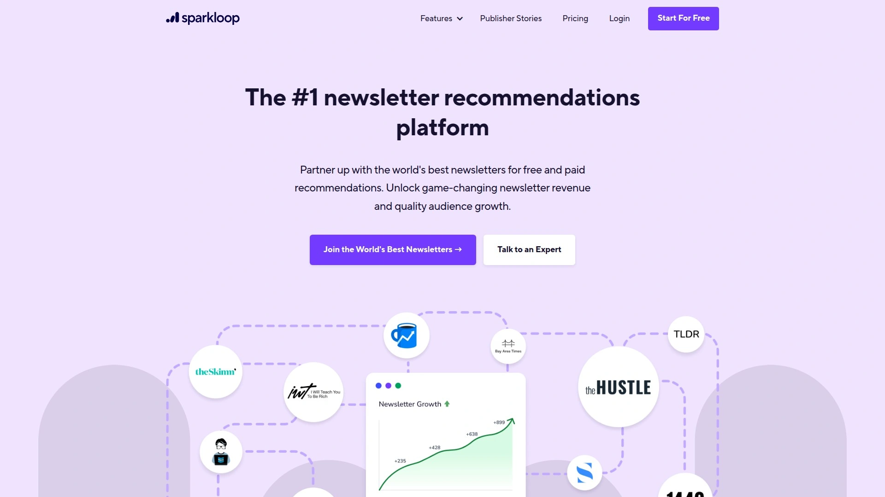

**SparkLoop** is a specialized referral platform tailored for newsletters and publishers. If you run an email newsletter and want to implement the kind of referral program that helped brands like *Morning Brew* or *The Hustle* explode in growth, SparkLoop is the tool to use. It allows you to add a **refer-a-friend program directly into your newsletter**: each subscriber gets a unique referral link, and you can set up reward tiers (e.g., refer 5 friends to get a bonus issue, 10 friends for exclusive merch, etc.). SparkLoop handles all the tracking and attribution, and it plugs into popular email service providers (such as Mailchimp, ConvertKit, Revue, etc.) so that referral data flows into your email lists seamlessly. They even offer a *Partner Network* where you can collaborate with other newsletters for cross-promotion. SparkLoop is known for its ease of setup – many newsletter writers get it running in under an hour – and for robust features like double opt-in verification (to ensure referral subscribers are real) and anti-fraud measures. If your goal is to **grow newsletter subscribers through word-of-mouth**, SparkLoop provides a proven blueprint, used by some of the world’s biggest newsletters. *(No free plan, but pricing is performance-based starting around $99/month, and they offer a 14-day trial. Also features a commission-based partner program for refer-a-newsletter promotions.)*

## [Referral Factory](https://referral-factory.com)
*No-code referral program builder with templates.*

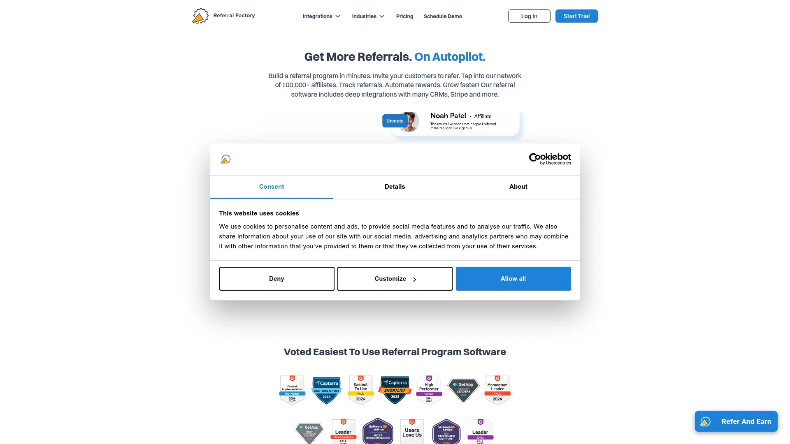

**Referral Factory** is a plug-and-play platform to launch referral programs (for customers or affiliates) without any technical headaches. It comes loaded with **100+ editable templates** for various referral and loyalty campaign scenarios, so you can literally select a template, tweak the text/rewards, and go live. The appeal here is speed and simplicity – you can have a referral or giveaway campaign ready to roll in minutes, complete with hosted referral pages that you can brand with your logo and colors. Referral Factory supports 20+ languages, which is great for international businesses. For tracking, it provides real-time analytics and automated fraud detection to manage duplicate or fake referrals. Power users will appreciate that it connects with thousands of apps (direct integrations and via Zapier) enabling things like automatic reward fulfillment through Stripe, CRM updates, etc. You can run both **customer referral programs and affiliate programs** side by side, giving flexibility in how you incentivize people. If you’re not sure how to design a referral campaign from scratch, Referral Factory essentially gives you a **referral program in a box** – just add your branding and incentives. *(15-day free trial; plans start around $95/month for basic packages, scaling up with higher participant counts and white-label options.)*

## [Easypromos](https://www.easypromosapp.com)
*Comprehensive platform for contests across social networks.*

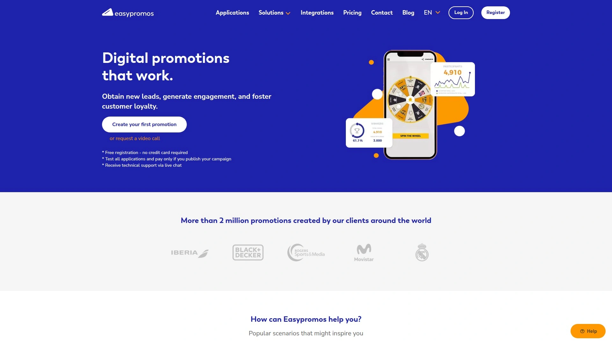

**Easypromos** lives up to its name by making it easy to create a wide array of interactive promotions and contests. It offers **30+ different promotion types** – including classic sweepstakes, photo/video contests, quizzes, polls, hashtag contests, and more – all from one platform. This versatility means you can run anything from a simple Facebook giveaway to a multi-stage contest with voting rounds. Easypromos also supports UGC (user-generated content) campaigns, where participants submit entries (like photos) and you can showcase them in galleries for public voting. The platform integrates well with Facebook, Instagram, Twitter, YouTube and can also embed contests on your website or as a microsite. For businesses, there are great features like **white-label branding**, multi-language support (30+ languages), and detailed analytics to measure engagement. Agencies often use Easypromos because it allows managing multiple client promotions under one roof and offers collaboration tools. One thing to note is Easypromos pricing works on a per-campaign or subscription model – smaller businesses might run one-off contests using a one-time plan, whereas high-volume users opt for subscriptions. In sum, Easypromos is a **powerful and flexible contest platform** ideal for those who want lots of campaign options and professional-grade features (with a bit of a learning curve). *(Limited free trial or free demo contests; paid plans vary by campaign type, starting around $29 per campaign for basic features up to enterprise subscriptions.)*

## [Woobox](https://woobox.com)
*Classic platform for social promotions and giveaways.*

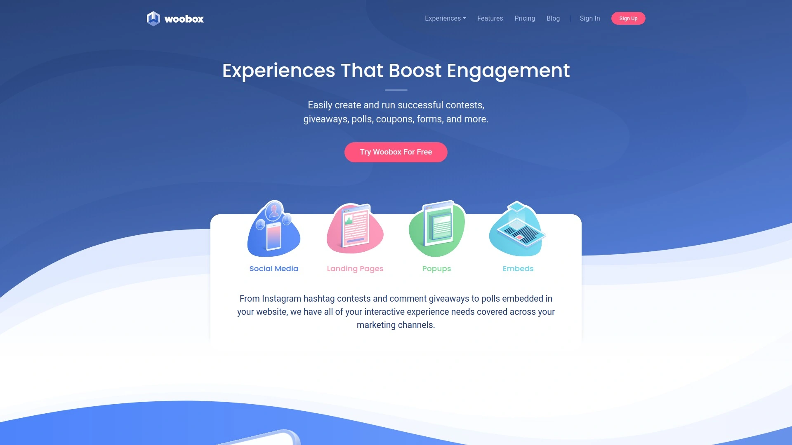

**Woobox** is an established platform that helps you create and manage a variety of marketing campaigns, especially on social media. With Woobox you can launch sweepstakes, pick random winners from Facebook or Instagram engagements, run photo and video contests, create polls and personality quizzes, and even build instant coupon offers. It’s like a Swiss army knife for **social media promotions** – many Facebook page managers and social marketers have used Woobox for years to boost engagement. The interface is straightforward: you choose a campaign type, fill in the details (images, form fields, rules), and Woobox generates a responsive landing page or app for the campaign. You can require participants to perform actions like “Like our page” or “submit their email” to enter, and for social networks, Woobox has tools to integrate directly (for example, importing comments for a giveaway draw). A notable feature is the “Rewarding Referrals (bonus entries)” option, which allows you to give entrants extra chances to win if they refer friends – adding a viral element to a basic contest. Woobox supports embedding contests on your website as well, and you can even **host campaigns on Facebook tabs** if needed. With a free plan that lets you try out basic campaigns and affordable paid plans, Woobox remains a reliable, no-frills option to **grow followers and engage users through contests**. *(Free basic plan with limited features; paid plans start at ~$37/month for expanded capabilities and higher entry caps.)*

## [DojoMojo](https://dojomojo.com)
*Partnership marketing network for joint giveaways.*

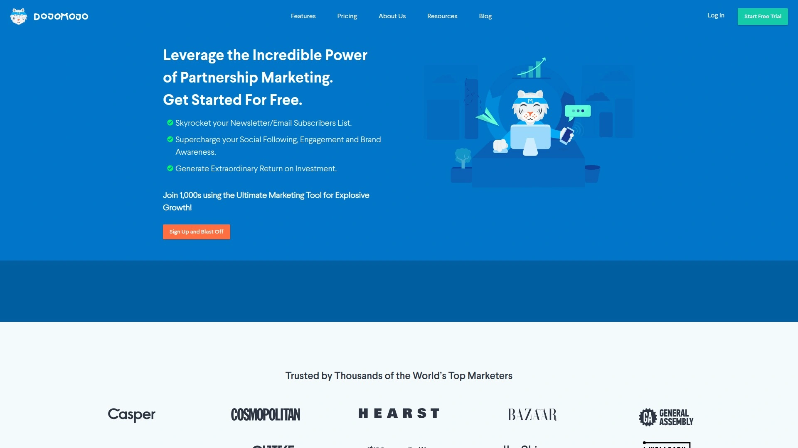

**DojoMojo** takes a unique approach by focusing on **co-branded giveaway campaigns**. It’s essentially a network where brands can team up to run massive giveaway contests together, pooling their audiences to achieve bigger reach. On DojoMojo, you might see a travel gear company, a tourism board, and an outdoor apparel brand jointly host a sweepstakes to win a dream vacation – each partner brand contributes a prize and gets exposure to the others’ audiences. The platform provides an interface to **find and collaborate with partner brands** (they call it a partnership marketplace) and build an end-to-end campaign with them. DojoMojo handles the landing page creation, email capture, and winner selection, making it easy for multiple companies to coordinate. For individual businesses, joining these partnered giveaways can rapidly grow your email list and social followers by tapping into complementary brands’ fans. Aside from the network aspect, you can also use DojoMojo to run your own standalone contests and referral campaigns. It offers templates and a drag-and-drop editor, plus promotional email tools to nurture the leads you gain. If you like the idea of cross-promotion and want to **acquire customers through strategic brand partnerships**, DojoMojo is built to facilitate exactly that in the context of viral giveaways. *(Platform access requires sign-up; pricing varies, but they have a free tier for joining up to a certain number of partnership campaigns, with paid options for more features and sponsorship opportunities.)*

## [Socialman](https://socialman.net)
*Simple multi-platform giveaway app with scheduling.*

**Socialman** is a handy app for hosting social media giveaways across multiple channels. It’s particularly useful for influencers, streamers, or small brands who run contests on platforms like Twitter, Instagram, YouTube, or Twitch and want a centralized tool to manage them. With Socialman, you can create a giveaway and let people enter via various actions: following accounts, retweeting, commenting on a post, etc., depending on the platform. The app provides **ready-made templates and a scheduler** so you can plan your giveaway posts in advance. One cool feature is that Socialman can automatically verify whether participants completed the required actions (for example, it will check if someone actually followed your Twitter account if that was a condition to enter). This saves you manual effort in validating entries. Socialman also supports exporting the participant data and picking winners randomly through the app. It integrates with Discord and other community platforms as well, which is great for gaming or streaming communities. Overall, Socialman doesn’t have all the deep marketing features of bigger contest platforms, but it excels at making **small-scale social giveaways** quick and easy to run. It’s a lightweight solution with an affiliate program of its own for those who want to refer others, but more importantly, it’s **budget-friendly and straightforward**. *(Has a free tier for basic giveaways; premium plans unlock more entries and some automation features at modest monthly rates.)*

## [Friendbuy](https://www.friendbuy.com)
*Enterprise-grade referral and loyalty platform.*

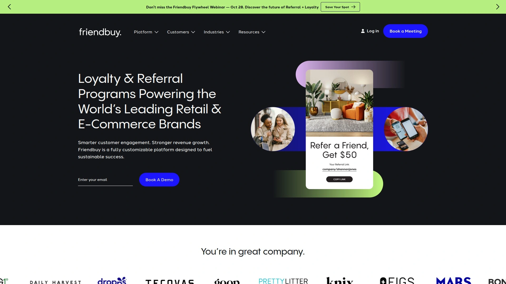    

**Friendbuy** is a top choice for larger e-commerce and B2C companies that want a robust, scalable referral program solution. It’s the engine behind refer-a-friend programs for many major retail brands and subscription services. Friendbuy offers highly customizable referral widgets that you can embed in your site or app, allowing customers to easily refer friends via email or social media. It also supports **omni-channel referral invites** – for instance, sending referral links via SMS or integrating with your mobile app notifications. A big strength of Friendbuy is its emphasis on data and optimization: you get A/B testing tools to compare different referral incentives or messaging, and detailed analytics on referral performance and ROI. The platform also includes a built-in **loyalty and rewards** module, so you can run points-based loyalty programs alongside referrals, all in one system. Security and fraud prevention are taken seriously (important for enterprise needs), and Friendbuy can handle complex reward rules (like tiered rewards, or rewarding different actions with different incentives). If you have a large customer base and need a referral solution that integrates deeply with your tech stack (lots of integrations and API capabilities) and can be tailored to your exact branding and workflow, Friendbuy delivers that **professional-grade referral experience**. *(No public pricing – typically custom enterprise pricing. Aimed at mid to large businesses; demo available on request.)*

## [Talkable](https://talkable.com)
*Advanced referral platform with rich analytics (enterprise focus).*

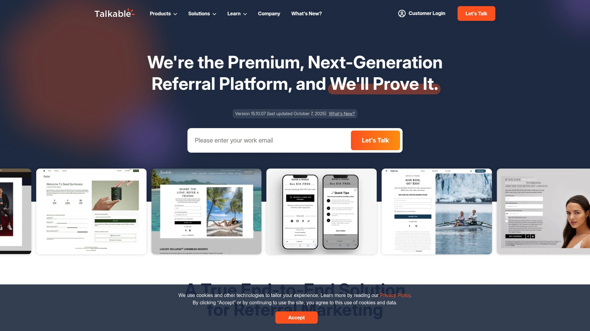

**Talkable** is another leader in the referral marketing space, particularly for enterprise and retail brands. It powers refer-a-friend campaigns for household names like TOMS Shoes and American Eagle, as well as targeted influencer and loyalty referral programs. Talkable stands out for its **comprehensive A/B testing and segmentation capabilities** – marketers can experiment with different referral offers or designs and segment referral invites by customer behavior, ensuring that the program is optimized for ROI. Over the years, Talkable has developed a sophisticated fraud detection system, reportedly saving clients millions by filtering out fraudulent referral attempts. It also introduced innovative features like **video referrals**, where customers can record a short testimonial video to share with friends, adding authenticity to the referral. The platform provides in-depth dashboards for tracking every step of the referral funnel (impressions, shares, clicks, conversions, etc.), and it integrates with e-commerce platforms, email service providers, and more for a seamless experience. Implementing Talkable does require more commitment – typically a longer onboarding and potentially developer assistance – but once set up, it’s a **powerful engine for customer acquisition** through word-of-mouth. Companies that need a tailor-made, secure, and highly optimized referral solution (and are ready for an annual contract) will find Talkable among the best in class. *(Enterprise pricing model; usually involves an annual license and onboarding fee. Best suited for brands with significant referral marketing budgets and dedicated support teams.)*

---

**FAQ**

**Q:** *How do I choose the right contest/giveaway platform for my needs?*
**A:** Start by identifying your campaign goals and audience. If you need a quick, no-frills giveaway to get emails, a simple tool like **KingSumo** or **RafflePress** might suffice. For multi-channel social media contests or lots of entry options, look at feature-rich platforms like **SweepWidget** or **Gleam**. If referrals and loyalty are your focus (common for e-commerce), consider **ReferralCandy** or **Viral Loops**. Also factor in your budget and tech skills – some enterprise tools offer deep customization but simpler platforms can launch a contest in minutes with no coding. Trialing a couple of top options with a small test campaign can help reveal which feels easiest and most effective for you.

**Q:** *Are these giveaway tools suitable for small businesses and beginners?*
**A:** Absolutely. Many of the platforms above cater to small businesses with **free plans or trials** and user-friendly interfaces. For instance, **SweepWidget** and **Woorise** have free tiers allowing you to run basic contests at no cost, and **VYPER** lets you design campaigns for free until you’re ready to publish. Tools like **ShortStack** or **Friendbuy** that target larger enterprises might be overkill for a very small business. But generally, if you’re a beginner, look for services that offer templates, drag-and-drop editors, and good support documentation (or chat support). Platforms such as **Gleam**, **UpViral**, and **RafflePress** are known for being quite approachable even if you’ve never run a contest before.

**Q:** *How do these platforms help prevent cheating or fraud in contests?*
**A:** Most reputable contest platforms have built-in fraud prevention features. Common measures include **mandatory email verification**, IP tracking to prevent duplicate entries, captcha tests (to block bots), and detection algorithms that flag suspicious activity (like one person making hundreds of referrals with fake accounts). For example, **ReferralHero** and **Talkable** put a strong emphasis on anti-fraud algorithms to ensure referral honesty, and **Gleam** automatically filters out invalid or repeat entries. When setting up your campaign, you can often enable options like limiting entries per person or requiring social logins to verify identity. It’s also good practice to manually review top entrants if it’s a high-stakes contest. Overall, the platforms here will handle the heavy lifting on fraud detection so you can run promotions confidently.

---

**Conclusion:** Growing your business through viral contests, giveaways, and referrals is much easier with the right tool in hand. The **top 25 platforms** listed here cover a wide spectrum of needs – from one-click giveaway simplicity to enterprise-grade referral analytics – so you can find your perfect fit. The key is to match the platform to your campaign goals and scale. In the end, a successful contest or referral program can significantly boost your brand’s reach and customer base. And if you’re looking to **kickstart a viral campaign quickly with minimal hassle**, **[VYPER](https://vyper.io)** stands out as a superb choice – it’s especially well-suited for rapidly launching high-engagement contests, thanks to its easy interface and powerful built-in virality features that can turn a small audience into a snowballing community of fans. Good luck, and may your next campaign go **truly viral**!
